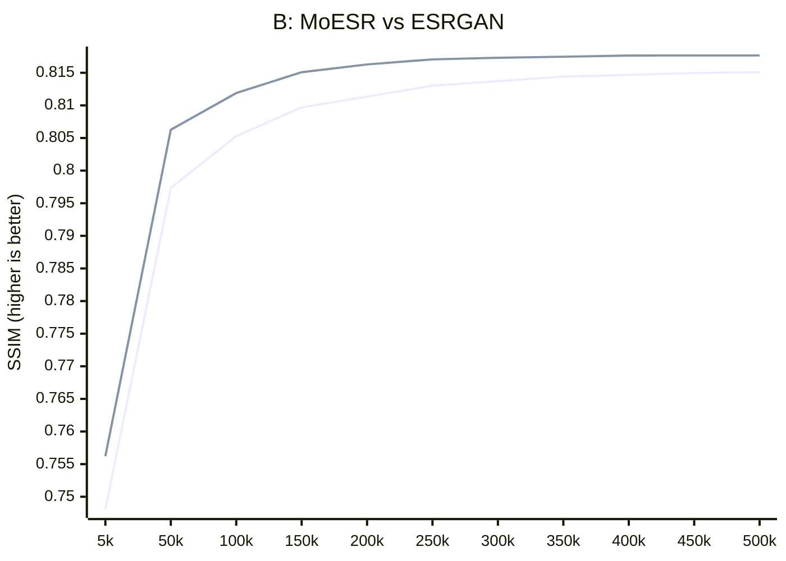

# MoESR: Mamba out Excitation Super-Resolution
This SISR (Single Image Super-Resolution) architecture is based on the [GatedCNNBlock](https://github.com/yuweihao/MambaOut/blob/main/models/mambaout.py#L119), introduced in the [MambaOut](https://github.com/yuweihao/MambaOut) repository. While technically the architecture has no direct connection to Mamba, I decided to retain the reference in the name to support the original author's joke. Previously, I developed the [MoSR](https://github.com/umzi2/MoSR) architecture based on this approach, and technically, MoESR is an extended version of it. The main goal of this extension is to compete with [ESRGAN](https://github.com/xinntao/ESRGAN), which remains one of the best in the mid-range segment of convolutional networks.
## Testing

### Acknowledgments  
Special thanks to **[the-database](https://github.com/the-database)** for conducting the testing and creating the pre-trained model.

### Training Setup  
- **Training framework:** [trainner-redux](https://github.com/the-database/traiNNer-redux)
- **Hardware:** RTX 4090 GPU  

### Training Settings  
- **Batch size:** 32  
- **LQ size:** 64  
- **EMA:** 0.999  
- **Loss function:** MS-SSIM_L1  
Val set: Urban100

|model_name|psnr|ssim|
|-|-|-|
|ESRGAN|26.98|0.8151|
|MoESR|**27.05**|**0.8176**|

pretrain safetensors - [original](https://github.com/the-database/traiNNer-redux/releases/download/pretrained-models/4x_DF2K_MoESR_500k.safetensors)

pretrain pth - [convert](https://drive.google.com/drive/u/1/folders/1DSTvXoAM0qV6cF7QUoKth2Yd8h0oBKsz)

[detect code](https://github.com/rewaifu/resselt/blob/main/resselt/archs/moesr/__init__.py#L9)
